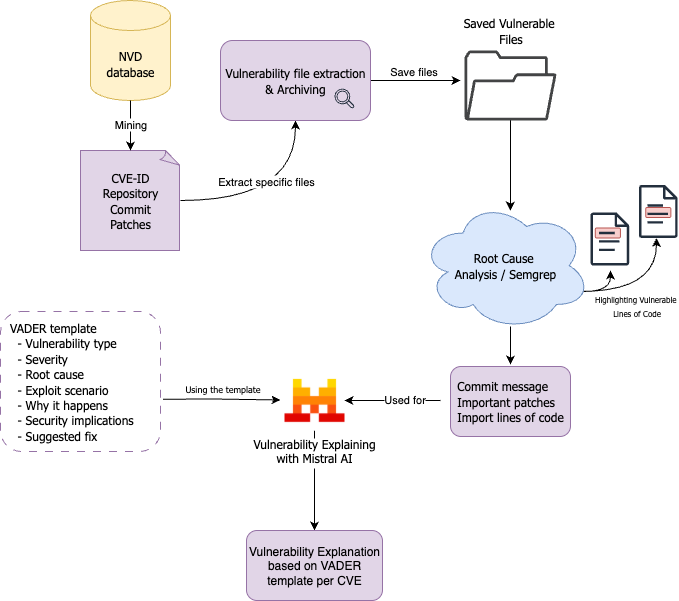

# Explainify

## What this small pipeline does:

*   First get the CWE's desired by using the `get_CWE.py` file. These result will be saved in the `commits_dataset_test.json` file. This file will only get the CVE's with the right CWE, and the the repository name, GitHub commit link and changed files are saved within this file. The patches are additionally saved in `patch_data/` folder, where they are saved per repository and each entry is a patch.
*   Then a root cause analysis is done in `relevant_patch.py` using Mistral:7b, where the LLM identifies the most important lines and patches from the `*_patch.json` files. These lines and patches are saved into `relevant_lines.json` per repository.
*   Then again Mistral:7b is in `CWE_runner.py` used for explaining the vulnerability using the GitHub commit, sha, and the most important code and lines of the patches. Explanation template is based on VADER. The results are saved in `explanations.json` per repository.
*   To view the results, `explanations_visual.py` leverages streamlit to show the results.

---

## Requirements

For running this project, Ollama is required, which can be installed using the steps from \[Ollama\]([https://github.com/ollama/ollama?tab=readme-ov-file](https://github.com/ollama/ollama?tab=readme-ov-file)). Download Ollama for your OS and pull  `mistral:7b` with: 

```
ollama pull mistral:7b
```

---

## Installation

1.  Clone or download the repository:

```
git clone explainify
cd explainify
```

1.  Run the bash script for executing the steps as mentioned before:

```
pip install -r requirements.txt
./job.sh
```

---

## Pipeline diagram

